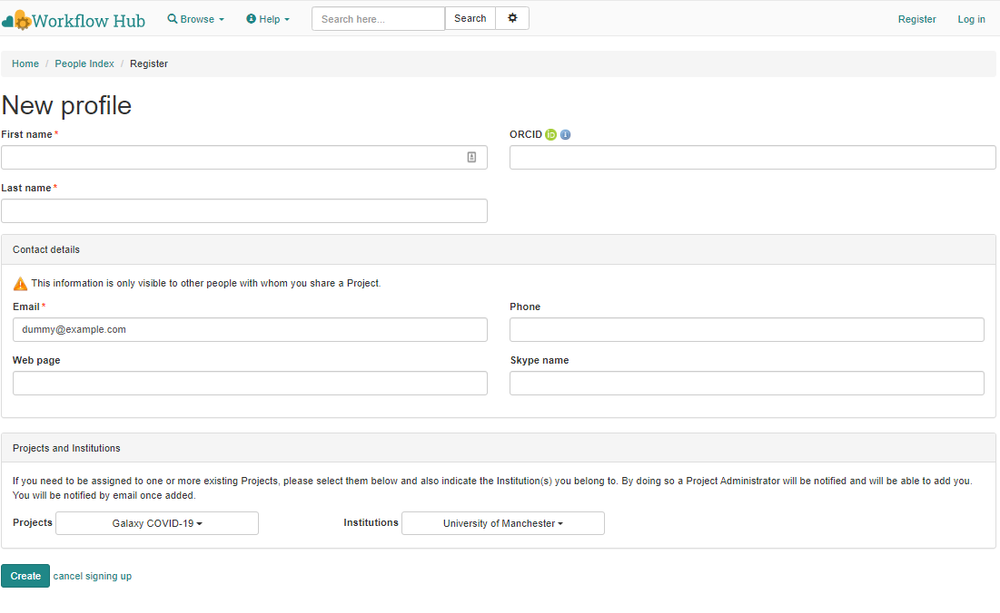

# How to register

> Which WorkflowHub instance?
> * Use <https://dev.workflowhub.eu/> for testing - this testing instance may occasionally be wiped
> * (TODO) Use <http://covid19.workflowhub.eu/> for long-lived workflow registrations - this will become the production instance

In order to register yourself in WorkflowHub, you need to click Register button in the top right hand corner of WorkflowHub.

It will take you to a screen where you need to provide

* A Login name (can be your real name, or another appropriate name)
* An email address
* A password for your account. When complete click the Register button in the bottom left hand corner.

You will then be taken to a screen where you will enter further information. We require the following information:

* First Name
* Last Name
* Your email address, which should be automatically populated from the previous screen.

It is recommended that you also add

* ORCID ID - if you do not have an ORCID you will need to register for one here http://orcid.org/

Information that is required is indicated with a red star.

If your project is already in WorkflowHub please select it from the dropdown menu. If your institute is already in WorkflowHub please select it from the dropdown menu.

If you don't join any listed project during registration, you can request to join a project or create your own project after the registration.  

After you have registered the rest of your information, you will need to activate your account. You will receive an email in the email account you have provided.
