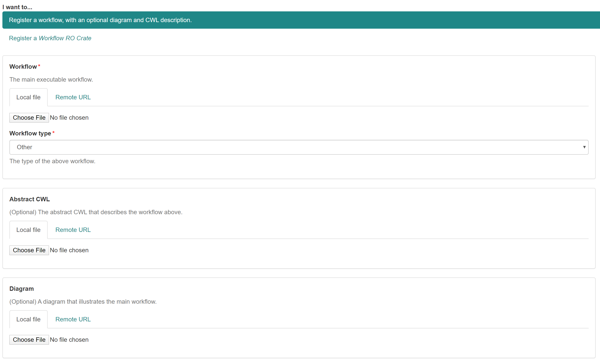

# Registering a workflow with optionally a diagram and/or abstract-CWL

## Uploading or referencing the files

The workflow and other associated files can be registered in two ways, uploading through the **Local file** tab or referencing through the **Remote URL** tab. In both options the file will be incorporated into the RO-crate, but when the workflow is referenced, it will also contain the remote URL in the metadata.

### 1. The main workflow file

This is the main workflow file that has to be uploaded/referenced. Specify the **Workflow type** of the main workflow in the dropdown list: Common Workflow Language(.cwl), Galaxy(.ga), KNIME(.knwf), Nextflow(.nf) or Snakemake(.snake). If your workflow type is not listed, please choose *other*.

### 2. The CWL abstract (optional)

The CWL abstract is used as a summary of the workflow to parse Inputs, Steps, Outputs and the description (doc) if provided. If you have a Galaxy workflow you can generate the CWL abstract with 
[galaxy2cwl](https://github.com/workflowhub-eu/galaxy2cwl). If your main workflow is a CWL workflow, you can skip this step. In the future it will also be possible to convert other workflow types to CWL abstract. 

### 3. The diagram (optional)

If your main workflow file is CWL, the diagram is automatically generated by the Workflow Hub website. In any other case you want a diagram in the RO-crate and on the WorkflowHub website, you will have to supply one yourself. In the upload/reference fields you can attach your diagram in .svg (preferred) or .jpeg/.png. 

### 4. Upload the files

Click upload.

## Filling in the metadata

The next page is basically a form to gather the necessary meta data that will be inclosed in the RO-crate.

### The fields:
- **Title\***: This field is mandatory and is with some workflow types pre-filled with the title of the workflow.

- **Description**: If a CWL (abstract) file is given, the description will be parsed automatically out of the `doc` attribute. In any other case this field can be used to write some documentation that will be showed on the workflow page.

- **Maturity**: This field can be used to specify in which maturity state the workflow is. The two available options are *work-in-progress* and *stable*.

- **Projects\***: Every workflow registration is linked to one or more projects. If you can not select the correct project, please go to [Joining a project](../How-to-join-a-project).

- **License**: The standard license is [Apache Software License 2.0](https://opensource.org/licenses/Apache-2.0). If you did not make the workflow yourself, be sure that the license corresponds to the license where you took the workflow from (for example [github licenses](https://help.github.com/en/github/creating-cloning-and-archiving-repositories/licensing-a-repository) ).

- **Sharing**: Specify who can view the summary, get access to the content, and edit the Workflow. This is possibly already filled in according to the selected project.

- **Tags**: Choose an appropriate tag for your workflow. Please check if your tag is already available and use the existing one if so. If you make a new tag, keep it simple without capitals or spaces. For example all new covid-19 workflows will be tagged with `covid-19`.

- **Creators**: This is an important section where all the people that where involved in making/publishing this workflow are listed. These creators will be added to the metadata in the RO-crate. 
    3 sections are used to specify the contributors or creators of the workflow.

    1. **So far you have specified the following creators**\
    This is by default filled in with *No creators*.
    
    2. **Please type creators into the box below - suggestions will be displayed as you type.**\
    If the creators or contributors to the workflow are registered in workflow hub, please use this field to search and select them.                   
    
    3. **If anyone not registered with WorkflowHub assisted creating this Workflow, you can specify them below.**\
    Use this field to fill in the remaining creators.
    

##  Check the uploaded workflow

