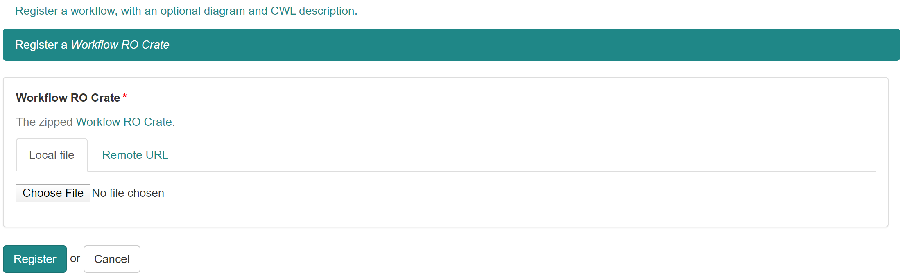

# Registering an existing Workflow RO-Crate

This option allows you to upload an existing Workflow RO Crate.

For more information on how to make a workflow RO-crate, please go to [How-to-make-a-workflow-RO-crate](../How-to-make-a-workflow-RO-crate)

## Uploading the RO crate

> TIP: Make sure that the uploaded or referenced files do not contain spaces in the filename. 

## Filling in the metadata

The next page is basically a form to gather the necessary meta data that will be inclosed in the RO-crate. This will mostly be filled in automatically by parsing the metadata found in the RO-crate JSON-LD. For correct parsing make sure that the RO-crate is following the [specification](../Workflow-RO-Crate) and has the `.crate.zip` file extension.

### The fields:
- **Title\***: This field is mandatory 

- **Description**: If a CWL (abstract) file is given, the description will be parsed automatically out of the `doc` attribute. In any other case this field can be used to write some documentation that will be showed on the workflow page.

- **Maturity**: This field can be used to specify in which maturity state the workflow is. The two available options are *work-in-progress* and *stable*.

- **Projects\***: Every workflow registration is linked to one or more projects. If you can not select the correct project, please go to [Joining a project](../How-to-join-a-project).

- **License**: The standard license is [Apache Software License 2.0](https://opensource.org/licenses/Apache-2.0). If you did not make the workflow yourself, be sure that the license corresponds to the license where you took the workflow from (for example [github licenses](https://help.github.com/en/github/creating-cloning-and-archiving-repositories/licensing-a-repository) )

- **Sharing**: Specify who can view the summary, get access to the content, and edit the Workflow. This is possibly already filled in according to the selected project.

- **Tags**: Choose an appropriate tag for your workflow. Please check if your tag is already available and use the existing one if so. If you make a new tag, keep it simple without capitals or spaces. For example all new covid-19 workflows will be tagged with `covid-19`.

- **Creators**: This is an important section where all the people that where involved in making/publishing this workflow are listed. These creators will be added to the metadata in the RO-crate. 
    3 sections are used to specify the contributors or creators of the workflow.

    1. **So far you have specified the following creators**\
    This is by default filled in with *No creators*.
    
    2. **Please type creators into the box below - suggestions will be displayed as you type.**\
    If the creators or contributors to the workflow are registered in workflow hub, please use this field to search and select them.                   
    
    3. **If anyone not registered with WorkflowHub assisted creating this Workflow, you can specify them below.**\
    Use this field to fill in the remaining creators.
    

##  Check the uploaded RO-crate

