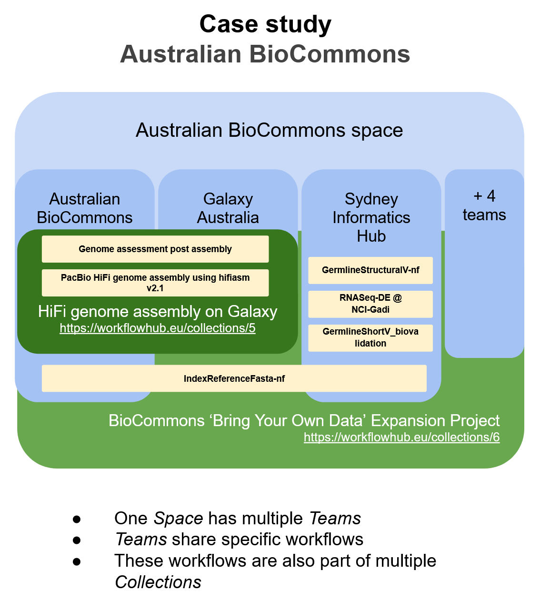

**If your research project is producing workflows, they should be registered in WorkflowHub:**

1. To **give visibility to the workflows created** by a project, and by the different networks and communities within the project 
2. To **give visibility to the workflows used** by a project 
3. To **share workflows** across a project, within project networks and externally 
4. To **credit and cite** the people making workflows, and the networks to which they belong 
5. To **track the new versions** of workflows as they are produced, and 
6. To **retain workflows** for post-project use by a project's members, their networks, and the broader scientific community

This generic version of Guide to Using WorkflowHub is intended to be cloned and customised for particular research projects, organisations and initiatives to form part of their project documentation.

**Authors:** Carole Goble, Finn Bacall, Stian Soiland-Reyes, Ove Johan Ragnar Gustafsson, Rafael Andrade Buono

**Cite as:** [https://doi.org/10.48546/workflowhub.sop.13.4](https://doi.org/10.48546/workflowhub.sop.13.4) 

## A workflows organisation in WorkflowHub

Even small workflow projects can be complex. As the individuals, networks and institutions that come together to develop workflows grow, so does this complexity. The contributors to such work need to be visible as workflow developer communities in their own right. At the same time they need to have both the workflows they bring to the project, and develop for the project, visible as their workflows. 

To address this, the WorkflowHub has 3 primary organisational structures that can be used by any workflow project.

### `Space`

**Describes a broad activity, such as a project consortium or a long-running activity. Within the Space are Teams.**

- A Space is self-administered. 
- The administrator has the power to create Teams. 
- A Space can have any number of Teams. 
- A Team (see below) can only be associated with one Space. 
- You can be a member of any number of Spaces.

### `Team`

**A group of one or more people collaborating together on a particular activity. The Team provides the ability to describe and promote the activity and give credit back to the team.**

- A Team is self-administered. 
- The Team administrator has the power to control the Team membership, and set default sharing permissions and licence across all members.
- Before you can register anything you need to be a member of a Team.
- You can be a member of any number of Teams.
- All workflows have to be registered with at least one Team, and can be registered with any number of Teams, which could also belong to different Spaces. This allows multiple Teams and Spaces to collaborate on specific workflows. 

### `Collection`

**A group of workflows explicitly curated into a collection (e.g. by domain, topic, or analytical approach). These are a way of gathering workflows in one place from across different Teams and different Spaces.**

- A collection is self-administered and managed by one or more nominated maintainers.
- The workflows that are being put into the collection must already be registered with at least one Team.
- A workflow can be registered with any number of collections.

## Structures for WorkflowHub Projects use cases

### Making use of Spaces and Teams

Spaces and Teams can be used to represent almost any type of research project or collaboration that requires the registration of computational workflows, ranging from individual workflow developers through to international research programs or science missions. In each case, the structure of your presence on WorkflowHub can be tailored to allow all contributors to gain credit, and for their contributions to be visible when workflows are found, explored and reused by the broader research community.

Three stereotypical project setups:

1. A **consortium** of pre-existing partners, where the consortium and the partners need to have visibility and credit for the workflows, and the consortium may disband (because it is a project)
2. A **large project** and/or **infrastructure** effort, where workflows need to be made discoverable and reusable 
3. An **independent Team** of workflow developers, or an independent developer, where the member(s) of the Team need to have visibility and credit for a dynamic set of workflows (legacy, stable and being maintained, in development) but don’t manage a Space.

Below are examples of how WorkflowHub can help organise workflows for these different setups.

### International project consortium

**Space:** [BY-COVID](https://workflowhub.eu/programmes/12)

**Teams:** 

- [BY-COVID (general)](https://workflowhub.eu/projects/215): This Team will register the workflows that can be organised into collection(s) of workflows used in BY-COVID
- [BY-COVID Baseline Use Case: SARS-CoV-2 Vaccine(s) effectiveness in preventing SARS-CoV-2 infection](https://workflowhub.eu/projects/159) - The Team contains workflow information related to an international collaboration on a use case of BY-COVID

### Infrastructure

**Space:** [Australian BioCommons](https://workflowhub.eu/programmes/8) 

**Teams:** 

- [Australian BioCommons (general)](https://workflowhub.eu/projects/30)
- [Galaxy Australia](https://workflowhub.eu/projects/54): This Team contains a set of curated workflows available for the [https://usegalaxy.org.au/](https://usegalaxy.org.au/) instance  

### Independent team

**Space:** [Independent Teams](https://workflowhub.eu/programmes/3) (some that are inactive not included) 

**Teams:** 

- [IWC](https://workflowhub.eu/projects/33): This Team contains workflows from the Intergalactic Workflows Commission. 
- [OME](https://workflowhub.eu/projects/69): This Team contains workflows related to the open microscopy environment community for image processing.
- [EuroScienceGateway](https://workflowhub.eu/projects/166): This Team registers the workflows related to the EuroScienceGateway project.

### Using Collections to group workflows 

Workflows can be grouped into collections. This allows users to organise workflows according to specific themes of their choice or to collect sets of workflows to be used in different contexts. For example, the workflow [ERGA DataQC ONT v2311 (WF0)](https://workflowhub.eu/workflows/697) is used as an initial step in two different collections: 

- [ERGA Assembly Galaxy ONT+Illumina & HiC Pipelines (NextDenovo-HyPo + Purge_Dups + YaHS)](https://workflowhub.eu/collections/17), and 
- [ERGA Assembly Galaxy ONT+Illumina & HiC Pipelines (Flye-HyPo + Purge_Dups + YaHS)](https://workflowhub.eu/collections/18)

Both collections are managed by the [ERGA Assembly Team](https://workflowhub.eu/projects/163). Members of other Teams can be added as `Maintainers` if required, which allows them to add and remove workflows from the collection.

## Case study: Australian BioCommons

An example of the application of this guide is given with the case of the [Australian BioCommons Space](https://workflowhub.eu/programmes/8). The Space contains multiple Teams. These include service related Teams such as the [Galaxy Australia Team](https://workflowhub.eu/projects/54), and research facilities such as the [Sydney Informatics Hub Team](https://workflowhub.eu/projects/43). Workflows are registered and maintained by Teams individually or in combination. For example, the [Somatic-ShortV-nf workflow](https://workflowhub.eu/workflows/691) is registered under both the Australian BioCommons and the Sydney Informatics Hub Teams.

## Registering workflows in WorkflowHub

### Joining WorkflowHub

1. [Log in to WorkflowHub](https://workflowhub.eu/login) 
   - [Register an account](https://workflowhub.eu/signup), or 
   - Log in using either GitHub or institutional credentials.
2. If relevant, make sure your WorkflowHub organisation matches that of required collaborative partners or institutions 
   - Search [https://workflowhub.eu/institutions](https://workflowhub.eu/institutions) before [creating a new organisation](https://workflowhub.eu/institutions/new) 
3. Either **Create**, or **Request to Join** any [Spaces](https://workflowhub.eu/programmes) and/or [Teams](https://workflowhub.eu/projects) that may be relevant to you. If there is a Project-specific versions of this guide it give you links to the relevant spaces or teams, see [https://workflowhub.eu/sops](https://workflowhub.eu/sops)

### Registering a workflow in WorkflowHub

To register a workflow:

1. [Log in to WorkflowHub](https://workflowhub.eu/login)
2. Pick `Workflow` from the `+` menu in the top navigation bar. 
3. You will be asked for the Team(s) it should be registered with. 
   - A workflow may be registered with many Teams. **You must be a member of the Team to be able to register it there.**
4. Add [description metadata](https://about.workflowhub.eu/docs/metadata-list/) to the workflow including tags. New tags can be added if required. 

### Adding a workflow to another Team

You uploaded a Workflow to a Team and now want to add it to another Team, maybe in a different Space:

1. [Log in to WorkflowHub](https://workflowhub.eu/login)
2. Select `Manage Workflow` from the “Actions” drop down menu. 
3. In the `Manage Workflow` pop-up, select the Team that you would like to add to 
4. Click the `Update` button at the bottom of the screen.

### Moving a workflow from one Team to another

You realised you put the workflow in the wrong Team?

1. [Log in to WorkflowHub](https://workflowhub.eu/login)
2. Select `Manage Workflow` from the `Actions` drop down menu. 
3. In the `Manage Workflow` pop-up: 
   - Add the workflow to the Team you want it added to.
   - Click the red cross next to the Team name you want it removed from.
4. Click the `Update` button at the bottom of the screen.

## Linking your workflow GitHub repository with WorkflowHub

During registration of the workflow:

1. [Log in to WorkflowHub](https://workflowhub.eu/login)
2. Pick `Workflow` from the `+` menu in the top navigation bar 
3. Make sure to choose the `Import Git Repository` option in the workflow registration wizard 
4. Add your GitHub repository URL and click `Register` 
5. Use the wizard to complete the registration process

Using the LifeMonitor App for automatic integration and versioning of workflows:

Follow the instructions available in the LifeMonitor documentation to [install the app](https://lifemonitor.eu/lm_wft_best_practices_github_app#installation) in your repository or organisation
Make sure to configure the “GitHub integration” in the “Settings” menu to:
Version based on a specific branch, and
Automatically check for issues and suggest pull requests
To integrate with WorkflowHub you need to activate this feature in the “Registry Integration” tab in the “Settings” menu. You also need to give the LifeMonitor app access permissions for your WorkflowHub account.

## Keeping workflows up-to-date

Workflows will keep being updated and those new versions will also need to appear on the WorkflowHub. Before you update a registered workflow, you need to ensure that you:

- Are [logged in to WorkflowHub](https://about.workflowhub.eu/docs/logging-in).
- Have the rights / permissions to change the workflow.
- Are on the workflow page of the workflow.

### Update the metadata of a workflow

1. Go to the `Actions` dropdown menu
2. Click `Edit Workflow` to change the metadata of the registered workflow. 

Note that you need to use Manage workflow to change its permissions or team ownership.

### Update the workflow version manually

#### If the workflow was imported via Git

Files can be added/removed/modified via the `Files` tab if the current version is `Open`.

A version must be `Frozen` before a new version can be created, or before a DOI can be minted.

**To freeze a version**

1. Go to the `Actions` dropdown menu
2. Click `Freeze Version` to lock the current version to changes

**To create a new version**

1. Go to the `Actions` dropdown menu
2. Click `New Version`
3. Decide either to continue managing the files on WorkflowHub (`Upload/Import files`), or switch to using a Git repository (`Import Git Version`).

#### If the workflow was uploaded manually, or via an RO-Crate

1. Go to the `Actions` dropdown menu 
2. Click `New Version` 
3. Either confirm the repository URL, or enter a different one (in the event that the workflow has moved to a different repository)
4. Select the branch/tag to import 
5. You may be prompted to reselect the main workflow if it can no longer be found 
6. Check / complete the metadata

### Update the workflow version automatically from GitHub

Updating workflow versions automatically from GitHub or local Git is due for release in Q2 2024

### Change the main workflow/abstract CWL/diagram

1. Click on the `Files` tab
2. Click `Annotate Files`
3. Select a new main workflow/abstract CWL/diagram by clicking the respective field and navigating to the appropriate file in the popup that appears
4. Optionally tick the `Re-extract metadata?` checkbox if you would like WorkflowHub to attempt to extract metadata from the newly selected main workflow/abstract CWL
5. Optionally check and confirm the metadata if the checkbox was ticked

## Linking workflows with other workflows

Workflows can be linked to other workflows in a number of ways

1. By being in the same collection ([see adding workflows to collections](#adding-and-removing-a-workflow-for-an-existing-collection))
2. By attribution, linking a workflow to one that it is derived from, as workflows are often variants of others. To attribute a workflow:
   - Go to the `Actions` dropdown menu
   - Click `Edit Workflow` and scroll down to the Attributions section, and click to expand it if it is not yet open. 
   - Begin typing the title of a workflow to search, and select one of the results that appear. 
   - Scroll down and click `Update` to confirm the changes. 

## Linking workflows with data

Workflows can be linked to data by uploading or linking this data in WorkflowHub

1. From the `Create` menu, select `Data Files`
2. Creating the record
   - File Selection
        - Here you have a choice of uploading files, or providing a reference as a URL to a file. 
        - Both of these are single-file links, you can consider providing a Zip or Tar archive if you have many files.
   - Provide a good title and description.
   - Be sure to include the relevant Team in the Teams List
   - Be sure to add the relevant tags to your workflow. Tags should be agreed upon within your project.
   - You can additionally link this dataset during creation to the correct workflows.

Alternatively if your dataset is already uploaded, then you can, under `Actions` → `Edit Workflow`, select your datasets from the `Data Files` section

## Publishing workflows

Workflows registered in [WorkflowHub](https://workflowhub.eu/) that are public can be assigned a [DOI (Digital Object Identifier)](https://www.doi.org/) so that they can more easily be cited in academic work and enter the scholarly knowledge graphs.

WorkflowHub DOIs are registered with [DataCite](https://datacite.org/) using the [DataCite Metadata Schema](https://schema.datacite.org/), meaning that the metadata joins the scholarly knowledge graphs [DataCite Commons PID Graph](https://commons.datacite.org/doi.org?query=client.uid:borq.00002-2021) and [OpenAIRE Research Graph](https://graph.openaire.eu/) (see [this example](https://explore.openaire.eu/search/software?pid=10.48546%2Fworkflowhub.workflow.160.1)).

You can assign DOIs for workflows you have registered and that you have been given write access to. You are not able to make DOIs for other people’s workflows.

The citation itself will appear on the workflow’s overview page.

### Assigning a DOI has two steps

#### 1. Check metadata

The metadata for the workflow will be part of the DataCite registration.

Before you mint a DOI, make sure you check the correctness of the [metadata of the workflow entry](https://about.workflowhub.eu/Registering-a-workflow-with-a-diagram-and-abstract-CWL/), and, for publicly accessible workflows, that it makes sense for someone who may not know your research in detail. 

Use both `Actions` -> `Edit Workflow` and `Actions` -> `Manage workflow` to fill in:

- Title (is it specific enough)
- Creators (you can include registered WorkflowHub users or others by name)
- Status of workflow 
- Description 
- License

For each of the registered users, check that their [ORCID identifier](https://orcid.org/) has been registered. This ensures that the people will be uniquely identified. Users can edit “My Profile” to link to ORCID.

#### 2. Freeze the workflow version 

Once a DOI is assigned that workflow version is fixed as a snapshot. So before minting a DOI, we need to freeze the version of the workflow in WorkflowHub, so that its metadata stays consistent with the DOI registration.
Each version of the workflow must be registered separately. 
You can create a new version of a workflow that has been assigned a DOI, without necessarily giving the new version a DOI yet. 
 

## Adding new Teams and collections

### Adding new Teams

Teams in WorkflowHub are groupings of people and their research outputs. In most cases a single team is sufficient, but often in collaborative research it can be beneficial to have multiple teams. See [Guide to organising your workflows on WorkflowHub](https://about.workflowhub.eu/docs/organising-workflows/) for more information about organising Teams and Spaces.

1. [Log in to WorkflowHub](https://workflowhub.eu/login)
2. Pick `Team` from the `+` menu on the top bar. 
3. Untick the `WorkflowHub managed Space?` 
4. Enter the desired Space name into the `Specify a title for a new Space` field. 
5. Add the Team metadata - the more the better. Remember this will be publicly displayed and no description looks bad. 
6. Add the name of the affiliation that you are associated with for this Team. It doesn’t have to be the same Institution as other Teams, and it is not unusual for it to be different. Start to type the name of your institution, and existing options will be displayed for selection. If not, choose the top option to define a new one. 
7. The Administrators will be notified and you will get an email confirmation. 
8. Once approved you can add members or others can apply to join. As you created the Team you are the administrator. You can add other administrators. Define within your project a set of administrators so to avoid depending on a single person and risking losing access to the Team.

### Adding new collections

1. [Log in to WorkflowHub](https://workflowhub.eu/login) 
2. Pick `Collection` from the `+` menu on the topbar. 
3. Add the Teams associated with the collection. These will only be Teams where you are a member. 
4. Add the Maintainers of the Collection. You can add any WorkflowHub member as a maintainer, and they will be able to add and remove workflows from the collection. 
5. Tag collections as needed. 

As a manager of collection you are able to add any resource in WorkflowHub to it, even if they are not owned by you or your teams.

It is recommended that each project/team have a generic collection like [Workflows in EuroScienceGateway](https://workflowhub.eu/collections/13) will full editing rights for the whole team – the purpose of such a collection is to allow linking of third-party workflows that are used or further developed by the project even if they don’t have ownership of that workflow. 

### Adding and removing a Workflow for an existing collection

#### To add a Workflow to a Collection

1. [Log in to WorkflowHub](https://workflowhub.eu/login) 
2. Select the workflow you want to add by selecting the magnifying glass icon on the top bar next to the WorkflowHub logo 
3. Select the button `Add Collection` in the top right (next to all the other buttons) for the Collections that you have access to. Select the one you want to add to 
4. If the Collection you want to add to isn’t there then you are not in a Team associated with that Collection. You will need to go look at the Collection to see the Teams associated with it and request to join one of them.

#### To remove a Workflow from a Collection, or reorder it within the Collection

1. [Log in to WorkflowHub](https://workflowhub.eu/login) 
2. Go to the Collection 
3. Select the `Actions` button top right 
4. To remove a workflow, click the `Delete?` checkbox. 
5. To re-order a workflow in the Collection click and drag the item using the blue numbered button on the left side above or below another item. 
6. To modify the comment on an item, type into the text box. 
7. Click the `Update` button at the bottom of the page

## Other WorkflowHub features

### Standard Operating Procedures

WorkflowHub can also be used to register [SOPs](https://workflowhub.eu/sops). To register SOPs, you must be registered and logged in to your account. SOPs can be uploaded in a variety of formats (word files, e-lab notebooks, code, annotated spreadsheets etc), as well as being registered as a remote URL. Typically, projects will define the form their SOPs will take using a template.

SOPs are assets, just like Workflows. So anything you can do with a workflow (described above) you can do with a SOP. 

1. [Log in to WorkflowHub](https://workflowhub.eu/login)  
2. From the top navigation bar, select `+ Create` 
3. From the dropdown menu, select `SOP`
4. Select whether you wish to upload a `local file`, using the `choose file` button, or enter a `Remote URL` to locate your SOP 
5. Complete the fields, this includes:
   - Teams that the SOP is being registered with 
   - Sharing: publicly, with individuals, Teams, or Spaces - the wider the sharing the better visibility. 
   - Attributions: link to any existing SOPs that this SOP was based on. 
   - Workflows: links the SOP to existing workflows in WorkflowHub
6. Click `Register` to submit the SOP

SOPs can be versioned, use Register new version to reupload or use a versioned link.

#### Registering WorkflowHub guides as SOPs

This document and its [customised siblings](https://workflowhub.eu/sops?filter%5Btag%5D=WorkflowHub), should also be registered as a SOPs using the WorkflowHub tag, see for instance EuroScienceGateway project’s guide [https://doi.org/10.48546/workflowhub.sop.8.2](https://doi.org/10.48546/workflowhub.sop.8.2). Indicate the SOP [Generic Guide to using WorkflowHub](https://doi.org/10.48546/workflowhub.sop.13.1) as Attribution from the customised SOP, then assign it a DOI.

For WorkflowHub guides as SOPs it is recommended to use the following versioning system for the SOP entries:

1. First SOP version is Remote URL to a Google Docs “live” version of the guide where project participants can suggest edits. The Google Doc link should be shared with global Comment permissions or already have such rights from the project’s Google Drive.  Give that version a DOI, which is inserted in the top of this document and distributed in the project handbook.  
2. A versioned release/snapshot of the SOP is exported from Google Doc, e.g. to PDF or converted to Markdown (for the project’s own website or wiki).
   - Use `Register new version` and either upload the PDF or link to the website (with a version-specific URL).   You may assign a DOI to this version and link to it from project deliverables etc. – however any further updates are still done in Google Docs (version 1).

### Events, Presentations and Publications

WorkflowHub supports metadata and links to Events, as well as registering Presentations and Publications.

1. Select `Event` from the `+ Create` menu 
2. Fill out the metadata

Events can be linked to Publications and Presentations

1. Go to the `Actions` dropdown menu 
2. Click `Edit Event`
3. Scroll to the `Publications` or `Presentations` section and click to expand it 
4. Select the desired publication or presentation from the dropdown menu 
5. Click the `Update` button

Presentations, publications and SOPs can be linked to workflows in a similar way.

## Further documentation

- [WorkflowHub documentation](https://about.workflowhub.eu/docs/)
- [WorkflowHub AMA slides](https://docs.google.com/presentation/d/1RJQX7tJ42CsPIEYBjrHtdWmuTRhG2sIIMMBTij3j9ww/edit#slide=id.p)
